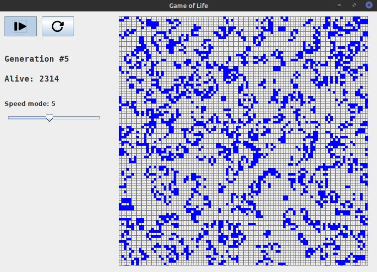

# Game_of_Life

### This project is a GUI version of a zero-player game called "Game of Life".
### After running the main() method, the GUI window appears with the generated initial state (1st generation) of the world, which starts to evolve. By default, every generation is displayed after 1s. The program enables users to pause/resume current evolution, restart evolution from the new initial state, and increase/decrease the pace of evolution. Additionally, the program shows the number of the current generation and the number of alive cells in the current generation.

